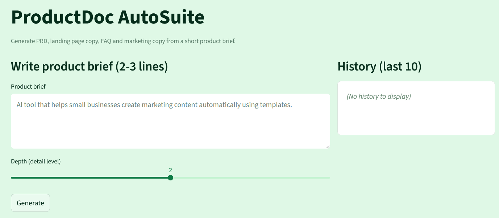

# ⚡ AutoGen AI



AI-powered product documentation generator with a modular FastAPI backend and a Streamlit frontend.

AutoGen AI converts a short product brief into high-quality outputs:
- Product Requirement Documents (PRDs)
- Landing page content
- FAQs
- Marketing copy

Built with OpenAI models, a clean modular architecture, user authentication, and per-user history tracking.

---

## 🚀 Features

### 🔹 Streamlit Frontend
- Clean UI for writing a short product brief  
- Adjustable depth slider for level of detail  
- History panel for last 10 generations  
- Responsive layout for demo & usage

### 🔹 FastAPI Backend
**Endpoints**
```bash
/generate  # generate PRD, FAQ, landing page, marketing copy
/signup    # register users
/login     # authenticate users
/history   # fetch recent generations
```

**Modular architecture**
```text
main.py      -> API routers
database.py  -> SQLite + SQLAlchemy DB
models.py    -> ORM models
prompts.py   -> prompt templates
utils.py     -> helper utilities
```

### 🔹 User Authentication
- Passwords hashed securely with `bcrypt`  
- SQLite storage for users & generation history  
- Simple token/session-based flow (demo-friendly)

### 🔹 AI Integration
- OpenAI GPT models for content generation  
- Centralized prompt templates for consistent outputs  
- Offline-safe demo fallback

---

## 📁 Project Structure

```text
auto_gen_ai/
├── assets/
│   └── ui_preview.png
├── backend/
│   ├── main.py
│   ├── database.py
│   ├── models.py
│   ├── prompts.py
│   ├── utils.py
│   └── routers/
├── frontend/
│   ├── app.py
│   └── requirements.txt
├── productdoc.db
├── .env.example
├── .gitignore
├── README.md
└── LICENSE
```

---

## 🧱 Clean Architecture (Visual Overview)

```text
───────────────────────────────────────────────────────────────────────────────
┌──────────────────────────────────────────────────────────────────────────────┐
│ PRESENTATION LAYER        (UI - Streamlit)                                   │
│                                                                              │
│   • frontend/app.py                                                          │
└──────────────────────────────▲───────────────────────────────────────────────┘
                               │
───────────────────────────────│───────────────────────────────────────────────
                               │
┌─────────────────────────────────────────────────────────────────────────────┐
│ APPLICATION / USE CASES LAYER                                               │
│                                                                             │
│   • backend/main.py     • backend/prompts.py     • backend/utils.py         │
└──────────────────────────────▲──────────────────────────────────────────────┘
                               │
───────────────────────────────│───────────────────────────────────────────────
                               │
┌──────────────────────────────────────────────────────────────────────────────┐
│ DOMAIN LAYER               (Business Entities)                               │
│                                                                              │
│   • backend/models.py                                                        │
└──────────────────────────────▲───────────────────────────────────────────────┘
                               │
───────────────────────────────│───────────────────────────────────────────────
                               │
┌───────────────────────────────────────────────────────────────────────────────┐
│ INFRASTRUCTURE LAYER                                                          │
│                                                                               │
│   • backend/database.py                                                       │
└───────────────────────────────────────────────────────────────────────────────┘
```

---

## ⚙️ Installation & Setup

### 1. Clone the repository
```bash
git clone https://github.com/nirjanadas/auto-gen-ai.git
cd auto-gen-ai
```

### 2. Install dependencies
```bash
pip install -r requirements.txt
```

### 3. Create a `.env` file
```env
BACKEND_URL=http://localhost:8000
OPENAI_API_KEY=your_key_here
```

### 4. Run the backend
```bash
cd backend
uvicorn main:app --reload --port 8000
```

### 5. Run the frontend
```bash
cd frontend
streamlit run app.py
```

---

## 🔐 Authentication Flow
- Users sign up with email & password  
- Passwords are hashed with `bcrypt`  
- Login returns a session token  
- Per-user generation history is stored in SQLite

---

 ## 🧠 Tech Stack

<div align="center">

### 🖥️ **Frontend**
| Technology | Purpose |
|-----------|----------|
| 🎨 Streamlit | UI & user interaction |
| 🐍 Python | Core language |

### ⚙️ **Backend**
| Technology | Purpose |
|-----------|----------|
| 🚀 FastAPI | API framework |
| 🏗️ SQLAlchemy | ORM & database layer |
| 🗄️ SQLite | Lightweight database |

### 🤖 **AI**
| Technology | Purpose |
|-----------|----------|
| 🔮 OpenAI GPT Models | Content generation |

### 🔐 **Security**
| Technology | Purpose |
|-----------|----------|
| 🔑 bcrypt | Password hashing |
| 🧩 .env Config | Secure environment variables |

</div>


---

## 🤝 Contributions
Contributions welcome. For major changes, please open an issue to discuss.

---

